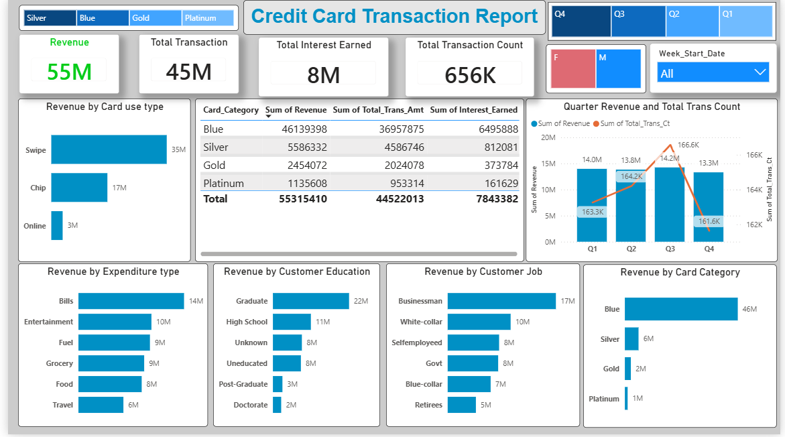
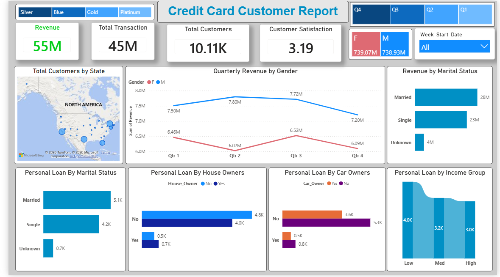

# 💳 Credit Card Analytics Dashboard | Power BI

An interactive Power BI dashboard built to analyze credit card transactions and customer behavior. This project was created for practice to improve my skills in Power BI, DAX, Power Query, SQL, and dashboard design.

---

## 📌 Project Overview

This project consists of two interactive dashboards:

- 📈 Credit Card Transaction Dashboard
- 👥 Credit Card Customer Dashboard

The dashboards provide insights into customer spending patterns, transaction behavior, revenue, customer demographics, and business performance.

---

## 🛠 Tools Used

- Power BI
- Power Query
- DAX
- SQL
- Excel

---

## 📊 Dashboard Features

### 1. Credit Card Transaction Dashboard

- Total Revenue
- Total Transaction Amount
- Total Interest Earned
- Total Transaction Count
- Revenue by Card Category
- Revenue by Card Usage Type
- Revenue by Expenditure Type
- Revenue by Customer Education
- Revenue by Customer Job
- Quarterly Revenue Analysis
- Quarter, Gender, Card Category, and Week Filters

---

### 2. Credit Card Customer Dashboard

- Total Customers
- Customer Satisfaction Score
- Revenue by Gender
- Revenue by Marital Status
- Revenue by Income Group
- Personal Loan Analysis
- Customer Distribution by State
- Quarter, Gender, Card Category, and Week Filters

---

## 📈 Key Insights

- Blue card holders generated the highest revenue.
- Swipe transactions contributed the highest revenue compared to Chip and Online transactions.
- Bills and Entertainment were the top expenditure categories.
- Married customers generated more revenue than single customers.
- Graduates and business professionals contributed the highest revenue.
- Revenue remained stable throughout the year with a noticeable increase during Q3.
- The majority of customers do not own a personal loan.
- Higher income groups generally generated higher revenue.

---

## 📂 Dataset

The project uses a credit card transaction dataset containing customer information, transaction details, revenue, expenditure types, card categories, and demographic information.

---

## 🎯 Skills Demonstrated

- Data Cleaning with Power Query
- Data Modeling
- DAX Measures
- KPI Design
- Interactive Dashboard Development
- Business Insight Generation
- Data Visualization Best Practices

---

## 📸 Dashboard Preview

### Credit Card Transaction Dashboard

### Credit Card Customer Dashboard

---

## 🚀 Future Improvements

- Add Time Intelligence (WoW, MoM, QoQ, YoY)
- Customer Segmentation using RFM Analysis
- Forecast Revenue Trends
- Add Drill-through Pages
- Optimize Dashboard Performance

---

## 👨‍💻 About Me

I'm currently learning Data Analytics and Business Intelligence by building real-world projects using Power BI, SQL, Excel, and Python.

I'm always open to feedback and suggestions.

---

⭐ If you found this project useful, consider giving it a star.
